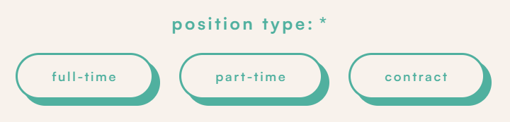
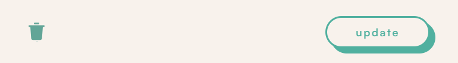
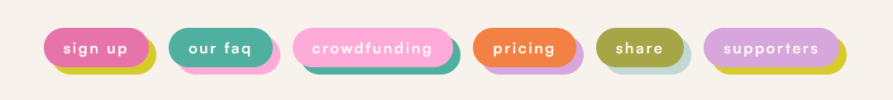
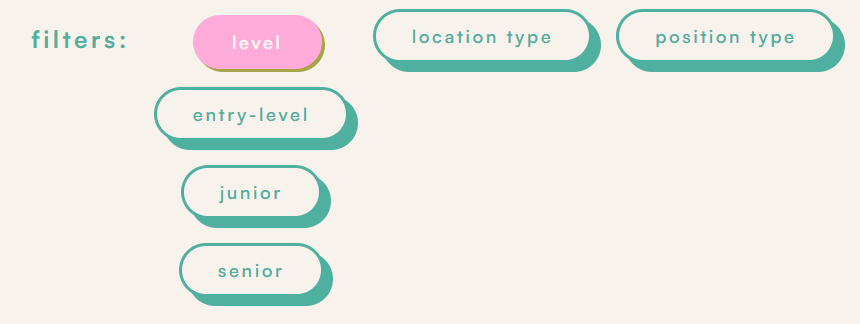
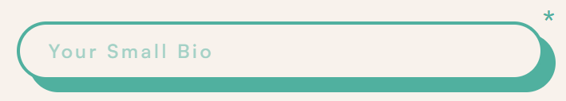
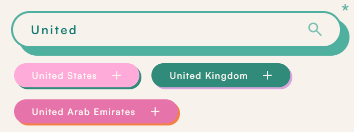
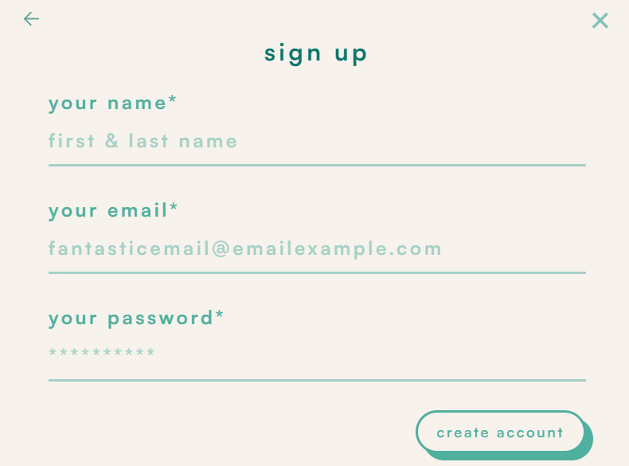
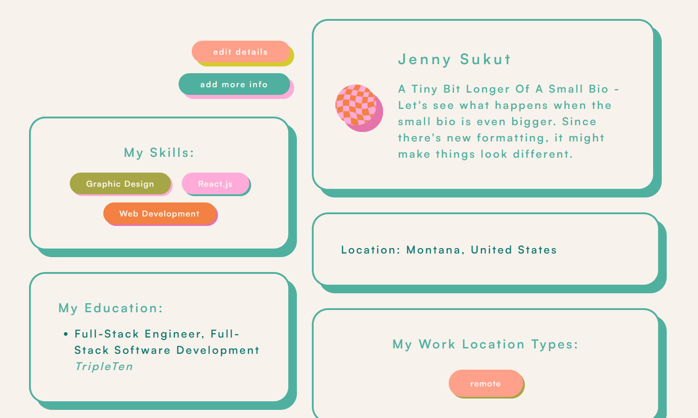
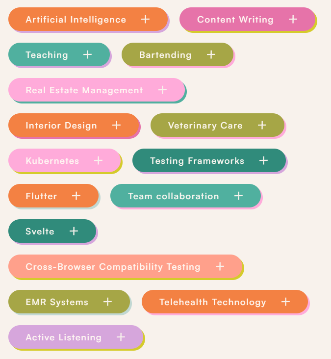

## Getting Started

Clone the repository:
https://github.com/jennysukut/straightforward-job-site-nextjs.git
Navigate to the project directory:
cd straightforward-job-site-nextjs
Install dependencies:
npm install
Run the development server:

1. Clone the repository: <br/>
   `https://github.com/jennysukut/straightforward-job-site-nextjs.git`
2. Navigate to the project directory:<br/>
   `cd straightforward-job-site-nextjs`
3. Install dependencies:<br/>
   `npm install`
4. Run the development server:<br/>

```
npm run dev
# or
yarn dev
# or
pnpm dev
# or
bun dev
```

## Notes

Our current rendition of the MVP has some placeholder Data in the Fellow Context - to remove and walkthrough creating a profile yourself, simply comment out the placeholder info and you're good to go!

## Our Current Pages

- Main Page: with all navigation options
- Fellow Signup Pages: 5 steps, each with their own page, to grab fellow's data to display on their profile
- Pricing Page: a copy of our pricing page from our landing page

## Current Contexts

- Modal Context, for setting up our modal popup structure
- Page Context, for keeping track of current active page and displaying relevant information, like different headers depending on the current page.
- Fellow Context, for manipulating + adding information for populating fellow's profiles while using localhost. In the future, we can use this in tandem with server calls or have it replaced by server calls completely if we'd like.
- Color Context, this is in the works - we'll need this to add additional color options to our site

## Current Components

- Modals for:

  - Logging In
  - Signing Up
  - Profile Population
  - Choosing an Avatar
  - Deletion Confirmation
  - Baseline Error Modal, copied from the landing page

- Button Components:

  - ButtonContainer // adds a framer motion effect to any buttons within it

  - ButtonOptionsComponent // takes input and displays separate buttons to be used in within forms + data handling
    

  - DropDownButtons // these buttons are ones that have the ability to open and display longer-form information. We use them in our landing page, but I don't think we'll keep them in the MVP.

  - RandomColorButton // I believe this generates a button with a random color. We've mostly replaced this with a specifically calculated pattern of button colors so there are good differences in the colors when you have a lot of items generated side-by-side

  - FormSubmissionButton // this button component is used on our modals used to gather and handle information. It has options to display deletion abilities depending on the "canDelete" prop.
    

  - SiteButton // Our fantastic + fun interactive drop-shadow buttons. You can drop lots of different options into this component to make all our site's buttons.
    

  - TieredButtonOptions // This is a verys specific set of buttons used for filtering in our search bar. It's where you have a top-tier set of ButtonOptions and then within them, a secondary set of ButtonOptions is connected to and displayed to one of the top-tier buttons. When you click a second-tier button, it sends it's value to the top-tier button.
    

- Input Components:

  - InputComponent // creates an input inside our hollow-design InfoBox - can register the input and displays the associated error when passed the correct props - it takes plain text and passes it into a form, we use this on step1 of profile population
    

  - InputComponentWithLabelOptions // this input component comes with a magnifying glass/search type ability, where it looks through an array that gets passed to the component and displays labels that match 2+ letters - The input can only be chosen through the labels. We can use this for necessary items that we need to have within certain parameters, like our Location Options, etc... This is generally used for setting a string input.
    

  - Label Generator And Display Component // this component is similiar to the inputComponentWithLabelOptions, but it displays the the array where the values are added as labels below the generator. This is generally used for creating and setting arrays within certain parameters, like our Skills List, etc...
    

  - Form Input Component // this is the inputComponent to be used on modals that are used to gather and populate information.
    

- Data Display Components:

  - InfoBox // this component is used for most information on our site. It has options for canAdd, canEdit, canSearch, etc... for manipulating to use for different types of displays. The InfoBox is used inside of other components as well, like the InputComponent.
    

  - SiteLabel // this component is a simple non-button display element that has options to display, add, or delete data, depending on props passed to it.
    

  - JobPost // this component is the one we use for displaying jobs on our Job Board and on the saved-jobs page.
    

- Functional Components:

  - AddHandler // this function will utilize props to call specific setFunctions, setValue and clearError functions when new information depending on the type passed into it.
  - UpdateHandler // this function takes an item and updatedData and replaces the previous item with updatedData
  - DeleteHandler // this function uses either Ids or a specific setFunction to search and delete selected data.

- Other General Components:

  - NavBar & Footer // self-explanatory
    
    

- Big Components:

  - FellowProfile // this is a functional component / page used to display fellow's profiles throughout the site. We have one set up for an individual's profile, but we'll also use this inside our applications for businesses to look at. We'll need to pass in the fellowData to be displayed in the component. We also have some controlled button options and will have other components inside this FellowProfile that'll be handled based on it's rendered context {ie. if it's someone looking at their own profile, or if the profile is being viewed in a job application}

  -BusinessProfile // this is a functional component / page used to display business profiles throughout the site. We can pass data into this component through the page so the business's data can be viewed by themselves with their own specific editing capabilities, but it can also be viewed by fellows when viewing job opportunities.

  - JobListing // this is a functional component / page that renders all the information for a job listing. We'll use the database and ID numbers to grab and display different job posts.
